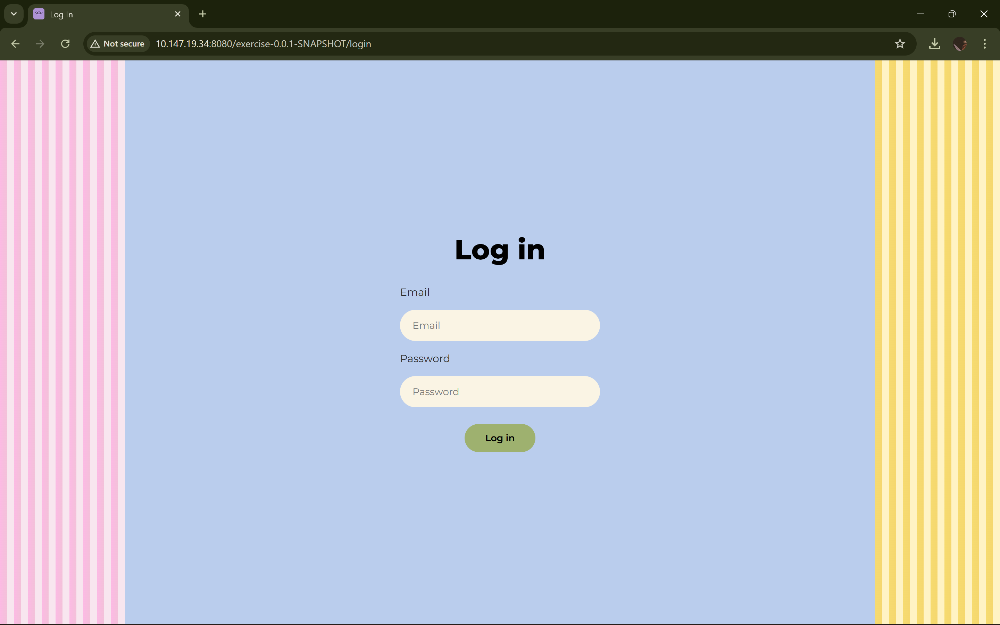
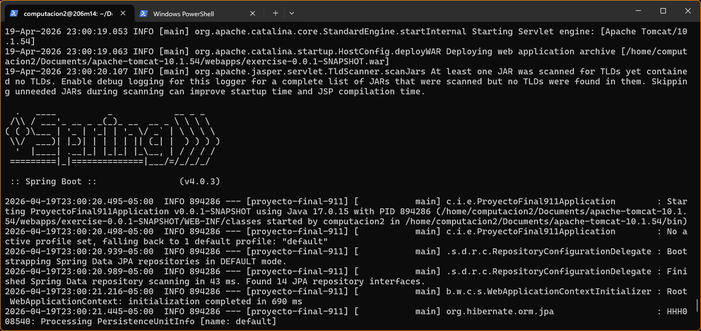
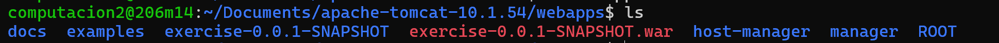

# Integrantes

- Juan Pablo Serrano (A00404067)
- Felipe Calderón (A00404998)
- Samuel Navia (A00405006)
- Maria Cristina Angulo (A00404027)

# Pasos de ejecución:

Diríjase al documento Instructions.md donde se especifica el procedimiento a seguir para ejecutar el proyecto.

# Comprobación despliegue:

Para la ejecución del server se empleó:

    10.147.19.34

Para la ejecución de la base de datos se empleó:

    10.147.19.38

